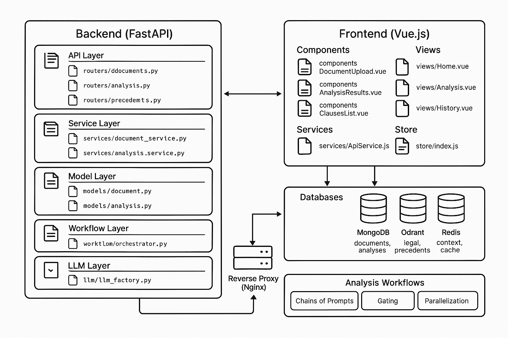

# PoC d'analyse de documents juridiques

Ce projet est une preuve de concept (PoC) pour un agent d'analyse de documents juridiques capable d'extraire automatiquement les clauses critiques d'un contrat et de proposer des recommandations, avec une interface web simple pour interagir avec le système.

## Fonctionnalités principales

- **Extraction de clauses** : Identification et extraction des clauses critiques du contrat
- **Recherche de précédents** : Interrogation d'une base vectorielle contenant des jurisprudences similaires
- **Analyse contextuelle** : Compréhension du contexte juridique et commercial du document
- **Recommandations** : Propositions de modifications ou d'actions basées sur l'analyse
- **Évaluation des risques** : Identification et quantification des risques juridiques potentiels
- **Interface utilisateur intuitive** : Formulaire de téléchargement de documents, affichage des résultats, historique des analyses

## Architecture



Le projet suit une architecture API-first avec les composants suivants :

- **Backend** : Python avec FastAPI pour les API RESTful
- **Frontend** : Interface web légère avec Vue.js
- **Base de données** : MongoDB pour les documents et métadonnées
- **Vectorisation** : Qdrant comme base de données vectorielle
- **Mémoire** : Redis pour le stockage du contexte
- **Conteneurisation** : Docker et Docker Compose pour tous les services
- **LLM** : Groq comme fournisseur de modèles de langage (compatible API OpenAI)

## Prérequis

- Docker et Docker Compose
- Clés API pour les modèles de langage (Groq, OpenAI ou Anthropic)

## Installation

1. Clonez le dépôt :
```bash
git clone https://github.com/votre-utilisateur/legal-document-analyzer.git
cd legal-document-analyzer
```

2. Copiez le fichier d'exemple d'environnement et configurez vos clés API :
```bash
cp .env.example .env
# Éditez le fichier .env pour ajouter vos clés API
```

3. Lancez l'application avec Docker Compose :
```bash
docker-compose up -d
```

4. Vérifiez que tous les services sont opérationnels :
```bash
./scripts/test_deployment.sh
```

L'application sera accessible à l'adresse : http://localhost

## Structure du projet

```
legal-document-analyzer/
├── docker-compose.yml             # Configuration complète de tous les services
├── .env.example                   # Template des variables d'environnement
├── api/
│   ├── Dockerfile
│   ├── app/
│   │   ├── main.py                # Point d'entrée FastAPI
│   │   ├── routers/               # Routes API
│   │   ├── services/              # Services métier
│   │   ├── models/                # Modèles de données Pydantic & MongoDB
│   │   ├── workflows/             # Implémentation des patterns de workflow
│   │   ├── llm/                   # Abstraction pour Groq, OpenAI, Anthropic
│   │   └── utils/                 # Utilitaires
│   └── requirements.txt
├── frontend/
│   ├── Dockerfile
│   ├── src/
│   │   ├── main.js                # Point d'entrée Vue.js
│   │   ├── App.vue                # Composant racine
│   │   ├── components/            # Composants UI réutilisables
│   │   ├── views/                 # Pages principales
│   │   └── services/              # Services frontend pour API
│   └── package.json
├── qdrant/                        # Configuration Qdrant
│   └── config.yaml
├── nginx/                         # Configuration du proxy inverse
│   └── nginx.conf
└── scripts/
    ├── setup.sh                   # Script d'installation
    ├── test_setup.sh              # Vérification de l'environnement
    ├── test_api.sh                # Test de l'API
    ├── test_frontend.sh           # Test du frontend
    ├── test_deployment.sh         # Test du déploiement
    └── seed_vector_db.py          # Initialisation de la base vectorielle
```

## Patterns de workflow implémentés

Le PoC implémente les patterns de workflow suivants :

1. **Chaînage de prompts** : Division du problème complexe d'analyse de contrat en étapes plus simples
2. **Gating (Portes)** : Implémentation de contrôles conditionnels pour sécuriser le processus
3. **Routage** : Aiguillage des tâches selon le type de contrat (emploi, prestation, partenariat...)
4. **Parallélisation** : Exécution de plusieurs analyses en parallèle sur différentes sections du document
5. **Orchestrateur-Ouvriers** : Décomposition et distribution des tâches à des sous-agents spécialisés
6. **Évaluateur-Optimiseur** : Implémentation d'une boucle qualité pour réviser et améliorer les résultats

## API

L'API REST est documentée avec Swagger/OpenAPI et accessible à l'adresse : http://localhost/api/docs

### Endpoints principaux

- `POST /api/documents/upload` : Télécharge un document juridique
- `GET /api/documents/{document_id}` : Récupère les informations d'un document
- `POST /api/analysis/start` : Démarre l'analyse d'un document
- `GET /api/analysis/{analysis_id}/results` : Récupère les résultats d'une analyse
- `GET /api/precedents/search` : Recherche des précédents juridiques similaires

## Interface utilisateur

L'interface utilisateur comprend trois pages principales :

1. **Page d'accueil** : Présentation du service et formulaire de téléchargement de document
2. **Page d'analyse** : Affichage des résultats d'analyse avec les clauses extraites, recommandations et risques
3. **Page d'historique** : Liste des analyses précédentes avec possibilité de consulter les résultats

## Tests

Plusieurs scripts de test sont fournis pour vérifier le bon fonctionnement de l'application :

```bash
# Vérification de l'environnement
./scripts/test_setup.sh

# Test de l'API
./scripts/test_api.sh

# Test du frontend
./scripts/test_frontend.sh

# Test du déploiement complet
./scripts/test_deployment.sh
```

## Déploiement en production

Pour un déploiement en production, il est recommandé de :

1. Utiliser des volumes persistants pour MongoDB, Redis et Qdrant
2. Configurer HTTPS avec Let's Encrypt
3. Mettre en place un système de monitoring (Prometheus/Grafana)
4. Configurer des sauvegardes régulières des données

## Licence

Ce projet est sous licence MIT. Voir le fichier LICENSE pour plus de détails.
# legal-document-analyzer
# legal-document-analyzer
